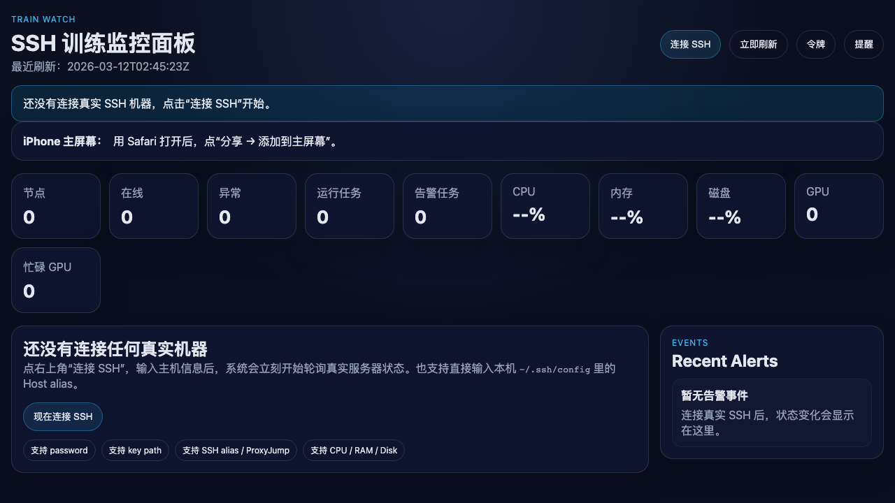
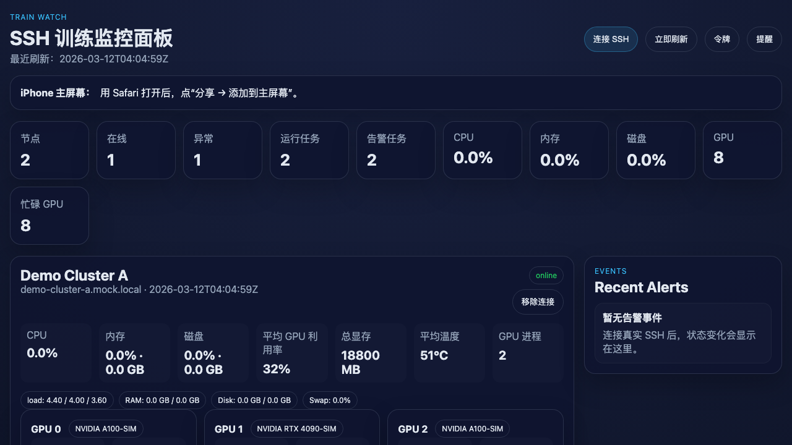

# Train Watch

A mobile-first SSH dashboard for monitoring real training jobs on Linux GPU servers.

Train Watch helps you check the state of long-running training workloads from your phone or desktop browser. It connects to remote machines over SSH, collects real system and GPU metrics, parses training logs, and surfaces the information that matters during model training: current task, loss, ETA, progress, and recent log state.

## Status

This repository currently includes two tracks:

- `v1` at the repository root: a self-hosted PWA built with `FastAPI + SQLite + static frontend`
- `v2` in `train-watch-v2/`: an in-progress native iPhone direct-SSH direction

## Features

- Local user auth with `viewer` / `operator` / `admin` roles, plus legacy shared-token access for scripts
- Session login, audit logs, persisted alert history, and alert acknowledgement endpoints
- SSH-based monitoring with password auth, key auth, local SSH aliases, and jump-host friendly workflows
- UI-added SSH connections survive restart via SQLite persistence, with password persistence opt-in
- Real metrics for CPU, RAM, disk, GPU utilization, VRAM, temperature, power, and GPU processes
- GPU/task correlation so each running task shows which GPU(s) it currently occupies
- Training-aware parsing for `loss`, `eval_loss`, `lr`, `grad_norm`, `step`, `step_total`, and `ETA`
- Run lifecycle detection for `idle`, `running`, `stalled`, `completed`, `failed`, and `unknown`
- Auto-discovery of training processes and likely log files when explicit log paths are not provided
- Shared-GPU FIFO queue with per-job GPU count, prepared commands, and automatic launch on resource release
- External queue visibility via auto-detected Slurm or a custom queue probe command
- Mobile-first PWA UI that can be added to the iPhone home screen

## Screenshots

| Empty state | Task monitoring |
|---|---|
|  |  |

## Quick Start

### Local start

```bash
./start.sh
```

Then open `http://127.0.0.1:8420`.

This script will:

- create `.venv` if needed
- install dependencies if needed
- start the app with `config.empty.yaml`

### Docker Compose

```bash
docker compose up -d --build
```

Useful commands:

```bash
docker compose logs -f train-watch
docker compose down
```

## Connect a Real Machine

After startup, click `Connect SSH` in the top-right corner.

Common connection methods:

### Reuse an existing SSH alias

If your local `~/.ssh/config` already contains a host alias, you can enter that alias directly in the UI and leave optional fields blank.

Example:

```ssh-config
Host gpu-lab-a
  HostName gpu.example.com
  User ubuntu
  Port 2222
  IdentityFile ~/.ssh/id_ed25519
```

In the web UI:

- `Host`: `gpu-lab-a`
- `User`: optional
- `Password`: optional
- `Key Path`: optional

### Fill host / port / user / credential directly

- `Host`: server IP or hostname
- `Port`: SSH port
- `User`: SSH username
- `Password`: SSH password, or
- `Key Path`: private key path such as `~/.ssh/id_ed25519`
- `External Queue Probe Command`: optional; leave empty to auto-try `squeue`, or provide your own command that prints JSON queue items

## What Train Watch Monitors

- node availability and health
- CPU, memory, and disk usage
- GPU utilization, memory, temperature, power, and GPU processes
- training log signals such as `loss`, `ETA`, `step`, and progress
- external scheduler / queue items when the host exposes them through `squeue` or a custom probe
- current task name, elapsed time, remaining time, and estimated finish time

## How Auto-Discovery Works

If you only provide SSH credentials, Train Watch still tries to discover active training jobs automatically.

It prioritizes:

- matching active training-like processes
- reading stdout/stderr file descriptors of those processes
- checking common output directories for recently updated log files

If you also provide `log_path`, `log_glob`, or `process_match`, extraction becomes more stable.

## Realtime Model

Train Watch is near-realtime rather than millisecond streaming.

- the backend polls on `server.poll_seconds`
- each cycle refreshes CPU, RAM, disk, GPU, and run state
- updates are pushed to the frontend over WebSocket after each poll

A `5s` poll interval is usually responsive enough for training monitoring.

## Access Modes

Train Watch now has three clear access modes.

- default local startup uses `config.empty.yaml`, which is personal mode and does not require login
- `personal`: no login at all, open the page and use it directly
- `personal-token`: page asks only for one access token
- `team`: page shows account login; if no user exists yet, the first screen becomes `Create Admin`

In personal mode, the top-right `Enable Team` button can switch the current deployment into team mode directly from the page. The change is persisted locally, and the next step is to create the first admin account.

Recommended behavior:

- for a private personal deployment, keep `shared_token` empty and `enable_user_auth: false`
- for a script-controlled personal deployment, set `shared_token`
- for a shared lab or team deployment, set `enable_user_auth: true`

In `team` mode, the intended first-run flow is:

1. open the page
2. see `Team Mode · Create Admin`
3. create the first admin directly in the web page
4. enter the dashboard automatically
5. afterwards, other users sign in with username and password

Role model:

- `viewer`: read dashboards, history, alerts, and metrics
- `operator`: refresh snapshots, add/remove connections, queue/cancel jobs, acknowledge alerts
- `admin`: manage users and inspect audit logs

## Alerting Model

Train Watch now exposes both transient status-change events and live current alerts.

- persistent alert history is available via `/api/v1/alerts`
- acknowledged alerts can be marked through `/api/v1/alerts/{alert_id}/ack`
- current alerts include node offline/degraded, run failed/stalled, and threshold-based CPU / memory / disk / GPU-temperature warnings
- Prometheus-style metrics are exposed at `/api/v1/metrics`

## Shared GPU Queue

Train Watch now also supports a lightweight FIFO queue for small teams sharing the same GPU box.

- choose an already connected SSH node
- enter the launch command and optional workdir
- request how many GPUs the job needs
- join the queue and let the scheduler wait for enough free GPUs
- once earlier queued jobs finish and enough GPUs are free, Train Watch launches the next job automatically

Current queue behavior is intentionally simple:

- FIFO is strict per node
- later small jobs do not skip an earlier larger job
- queued jobs can be canceled before launch
- running jobs are still monitored through the normal monitoring view after launch

## External Queue Visibility

Train Watch can now show queue items that were not submitted through Train Watch itself, but only when the remote machine exposes a queue source.

Current support:

- auto-detect `Slurm` via `squeue`
- optional per-connection custom probe command that prints JSON

Custom probe command contract:

```json
{
  "source": "lab-queue",
  "items": [
    {
      "id": "job-123",
      "owner": "alice",
      "label": "llama-sft",
      "status": "queued",
      "submitted_at": "2026-03-13T09:58:00Z",
      "gpu_count": 2,
      "command": "bash train.sh",
      "workdir": "/workspace/project",
      "reason": "waiting for free GPUs"
    }
  ]
}
```

Important limitation:

- on a plain shared Linux box with no central scheduler and no custom queue script, Train Watch cannot magically know every waiting task outside this app
- it can only show external queue items when the server already has a queryable queue source

## iPhone Usage

Open the app URL in Safari and choose `Share -> Add to Home Screen`.

That creates an app-like icon on iPhone, while `v1` still remains a PWA rather than a native iOS app.

## Repository Layout

- `app/`: backend, SSH collection, parsers, runtime, storage
- `static/`: no-build PWA frontend
- `tests/`: API, collector, parser, mock, and SSH support tests
- `train-watch-v2/`: native iPhone direct-SSH core scaffold
- `docker-compose.yml`: one-command startup
- `config.empty.yaml`: start empty, then add machines from the UI
- `config.example.yaml`: static config example
- `config.mock.yaml`: mock/demo config

## API

- `POST /api/v1/session/login`
- `POST /api/v1/session/logout`
- `GET /api/v1/session/me`
- `GET /api/v1/health`
- `GET /api/v1/metrics`
- `GET /api/v1/snapshot`
- `POST /api/v1/refresh`
- `GET /api/v1/history`
- `GET /api/v1/connections`
- `POST /api/v1/connections`
- `DELETE /api/v1/connections/{node_id}`
- `GET /api/v1/jobs`
- `POST /api/v1/jobs`
- `DELETE /api/v1/jobs/{job_id}`
- `GET /api/v1/alerts`
- `POST /api/v1/alerts/{alert_id}/ack`
- `GET /api/v1/users`
- `POST /api/v1/users`
- `PATCH /api/v1/users/{username}`
- `GET /api/v1/audit-logs`
- `WS /api/v1/stream`

## Tests

```bash
./.venv/bin/python -m unittest discover -s tests -p 'test_*.py'
```

If you do not use the bundled virtualenv, `python3 -m unittest discover -s tests -p 'test_*.py'` also works.

## Security Notes

Train Watch still works in simple single-user mode, but it now also supports local multi-user deployments.

- `server.shared_token` is optional; leave it empty for the simplest local/self-hosted setup
- if you expose the service beyond a trusted local environment, prefer `server.enable_user_auth: true` and bootstrap an admin account
- `server.shared_token` still works for automation, scripts, or reverse-proxy protected deployments
- session tokens are stored in browser session storage by the frontend and expire after `server.session_ttl_hours`
- frontend tokens are kept in browser session storage
- WebSocket authentication is sent as an initial auth message instead of a URL query parameter
- UI-added SSH connections are persisted in SQLite so they survive restart; by default, SSH passwords stay in memory and are not written to SQLite
- set `server.persist_passwords: true` only if you explicitly want password-based UI connections to survive restart
- SSH host keys now default to `accept-new`; switch `server.ssh_host_key_policy` to `strict` if you want pre-provisioned host keys only
- queue submitter names automatically fall back to the authenticated operator when omitted
- avoid committing real hostnames, usernames, ports, private paths, or secrets into the repository

## Roadmap

- [x] Real SSH monitoring
- [x] Password and key authentication
- [x] SSH aliases and jump-host friendly workflows
- [x] GPU / CPU / RAM / disk metrics
- [x] Training task auto-discovery
- [x] Loss / ETA / progress / estimated finish time
- [x] Mobile-first PWA
- [x] Shared GPU FIFO queue and auto launch
- [x] Local multi-user auth, sessions, audit logs, and persisted alert history
- [x] Prometheus metrics endpoint and threshold-based current alerts
- [ ] Native iPhone direct-SSH app in `train-watch-v2/`

## License

This repository inherits the root `LICENSE` already included in the project.
